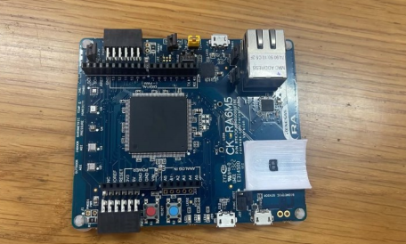
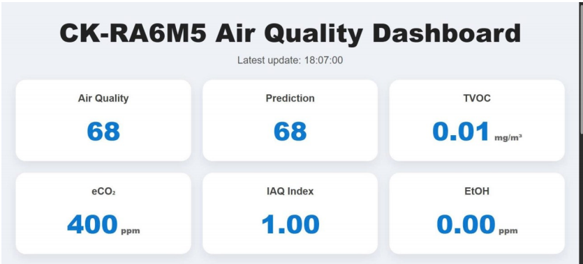

# edge-ai-iaq-monitor
Bare-metal Edge AI indoor air quality monitor &amp; predictor using Renesas CK-RA6M5 and ZMOD4410.
# Edge AI Indoor Air Quality Monitor & Predictor 

An embedded Edge AI system designed to monitor, process, and predict Indoor Air Quality (IAQ) directly on a microcontroller, bypassing traditional cloud processing limitations.
Built with the Renesas CK-RA6M5 kit and ZMOD4410 sensor, this project showcases hardware-software integration, register-level programming, and bare-metal Machine Learning deployment.

---

## System Architecture & Hardware

The system architecture shifts complex data processing to the edge node, optimizing latency, conserving bandwidth, and ensuring autonomous operation.

* **Core Microcontroller:** Renesas CK-RA6M5 featuring an ARM® Cortex®-M33 core running up to 200 MHz, equipped with DSP instructions and an FPU for efficient matrix operations.
* **Digital Gas Sensor:** ZMOD4410 IAQ sensor utilizing Metal Oxide (MOx) technology, communicating via I2C to measure Total Volatile Organic Compounds (TVOC) and estimate equivalent.
* **Serial Communication:** HW-597 USB-to-TTL module acting as the UART interface (configured at 115200 baud rate) to transmit telemetry data to a local computer.
* **Local Server & UI:** A custom Python backend that parses the serial data stream to serve a Real-Time Web Dashboard.

---

## Firmware & Edge AI Features

### 1. Register-Level Programming & FSP Integration
The firmware architecture leverages the Renesas Flexible Software Package (FSP) for the complex I2C sensor middleware. Concurrently, it utilizes direct register-level programming to configure the UART SCI3 module, manage status LEDs, and control the sensor's hardware reset pin (P307) to optimize system overhead.

### 2. On-Device Machine Learning (TinyML)
Instead of relying on a cloud server, the CK-RA6M5 microcontroller executes a Multivariate Linear Regression model directly in its memory to perform time-series forecasting of air quality. The inference algorithm predicts the next cycle using the following formula:
$PRED = b0 + b1 \cdot AQ(t) + b2 \cdot AQ(t-1) + b3 \cdot AQ(t-2) + b4 \cdot TVOC + b5 \cdot (eCO_2 - 400)$.

### 3. Real-Time Python Dashboard
The Python server continuously parses the incoming UART text stream (e.g., `AQ=89,TEMP=30,HUM=60,PRED=89...`) to visualize critical metrics. The dashboard displays:
* Relative Air Quality (AQ) & AI Prediction (PRED).
* TVOC concentration & $eCO_2$.
* Absolute IAQ Index & Equivalent Ethanol (EtOH) levels.
* Real-time trend graphs for historical monitoring.

---

## 📸 Project Gallery

| Renesas CK-RA6M5 Kit | Web Dashboard Interface |
| :---: | :---: | 
|  |  |

---

## Key Contributions

As a core developer on this two-person team, my specific responsibilities encompassed bridging the embedded hardware with the software processing logic:

* **Hardware Interfacing:** Configured the I2C protocol (SCL0/SDA0) to extract raw data from the ZMOD4410 and manipulated GPIO registers for precise hardware resets.
* **Firmware & Edge AI Implementation:** Coded the Multivariate Linear Regression model in C, enabling the MCU to perform localized, latency-free time-series predictions.
* **UART Communication:** Set up the SCI3 UART peripheral at the register level to ensure reliable 115200-baud data transmission to the backend.
* **Dashboard Development:** Assisted in building the Python server to decode the UART string and mapped the environmental data to a live, responsive web dashboard.

---

## Future Roadmap

* **Wireless IoT Integration:** Replace the USB-TTL module with an ESP8266 or ESP32 to transmit telemetry data wirelessly over Wi-Fi.
* **RTOS Implementation:** Transition from a bare-metal super-loop to FreeRTOS, isolating processes into independent scheduling tasks (`SensorTask`, `MLTask`, `UartTask`, `LedTask`).
* **Model & Sensor Upgrades:** Train the machine learning model using a real collected dataset and integrate physical temperature/humidity sensors to replace the current static compensation values.

## My Contributions

In this project, I was primarily responsible for configuring the core embedded system and deploying the intelligent algorithm at the edge. My specific contributions included:

* **Sensor Programming:** Developed the source code for initialization, measurement phase configuration, and raw data extraction from the ZMOD4410 digital air quality sensor via the I2C protocol.
* **Register-Level Programming:** Directly configured hardware registers on the CK-RA6M5 microcontroller for the UART SCI3 peripheral, status LEDs, and the P307 sensor reset pin to optimize execution speed and minimize system latency.
* **Linear Regression Deployment (Edge AI):** Translated the mathematical formula of the multivariate linear regression model into highly optimized C code, enabling the MCU to perform localized time-series inference directly in its memory without relying on cloud computing.
* **Hardware Debugging & Configuration:** Handled the hardware setup, troubleshooting, and debugging on the CK-RA6M5 development kit, resolving data synchronization issues over the USB-to-TTL interface to ensure a continuous, real-time data stream to the backend.
